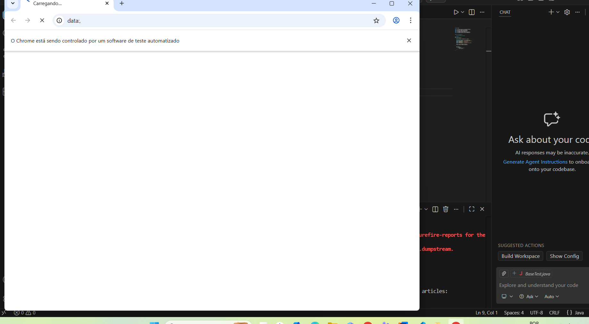

# 🧪 Functional Test Automation - Selenium

Projeto de automação de testes funcionais utilizando:

- Java 17
- Maven
- Selenium WebDriver
- JUnit 5
- WebDriverManager

---

## 📌 Objetivo

Automatizar testes funcionais web utilizando boas práticas de automação, organização de projeto e controle de versão.

---

## 📸 Teste em Execução



## 🛠️ Tecnologias Utilizadas

- Java 17 (Temurin)
- Maven
- Selenium WebDriver
- JUnit 5
- Git
- GitHub

---

## ▶️ Como Executar o Projeto

1. Clone o repositório:

```bash
git clone https://github.com/AnteroVieira/functional-test-automation.git

Acesse a pasta do projeto:    cd functional-test-automation

Execute no terminal " mvn clean test " ( VS Code)

obs: use as teclas Ctrl + ' para abrir o terminal

**Resultado: O chrome vai abrir**

Estrutura do Projeto:
src
 └── test
      └── java
           ├── base
           └── tests
